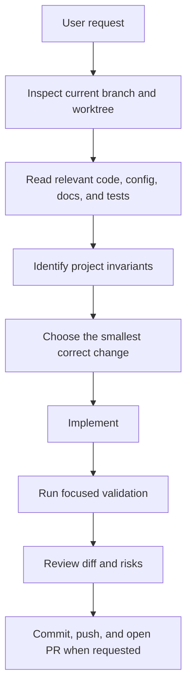
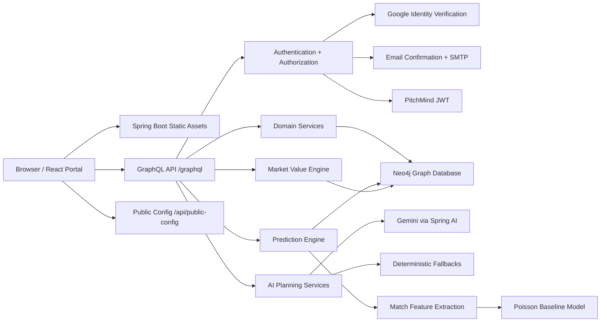
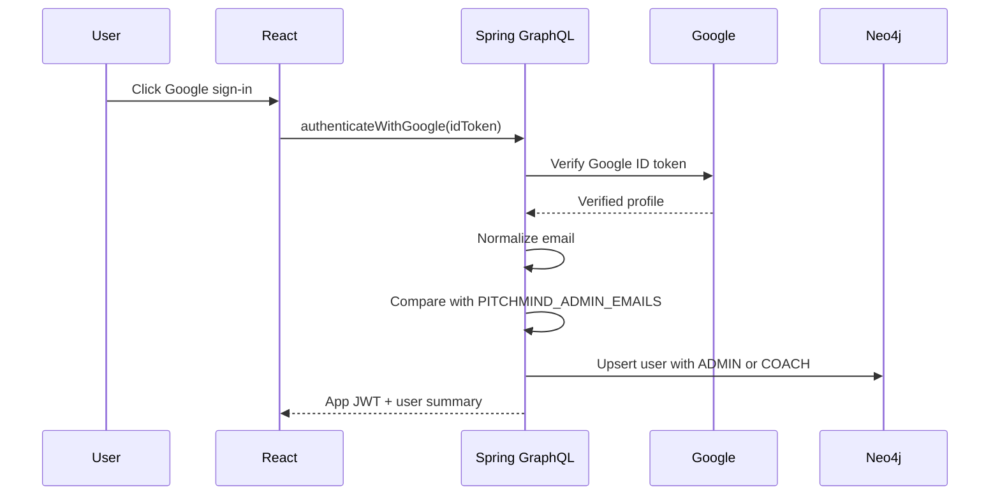
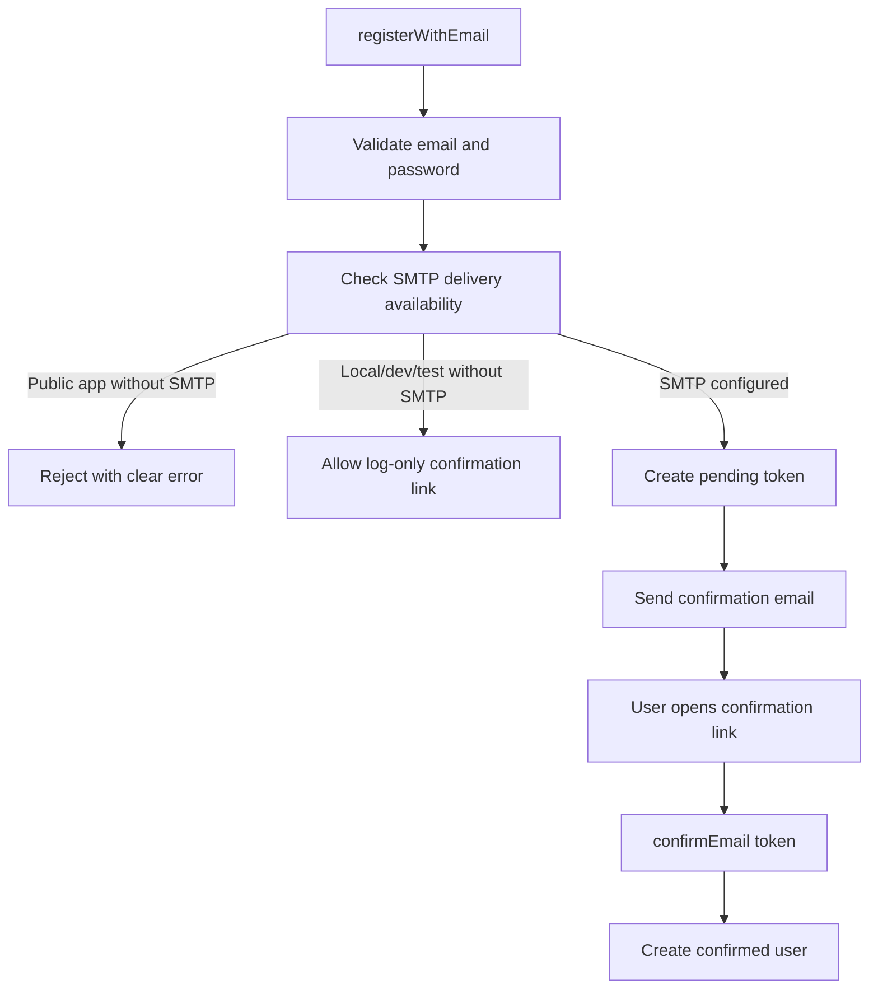
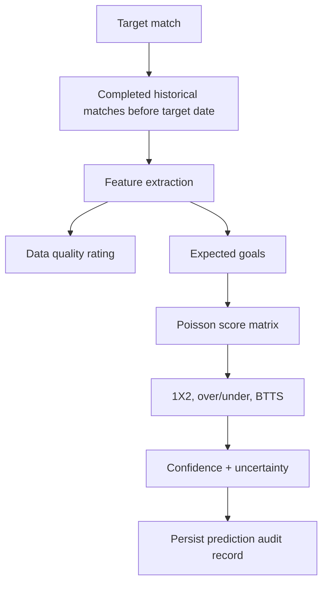
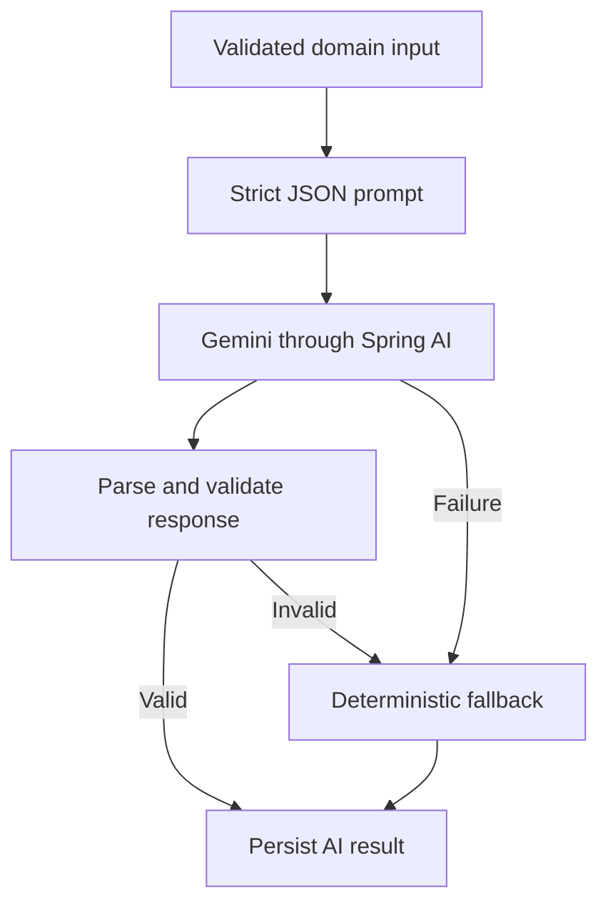

# Agent Workflow, Reasoning Model, and Roadmap

This document explains how human developers and AI coding agents should use `AGENTS.md` while working on PitchMind. It also describes the reasoning model expected in this project, the main architecture flows, and the next roadmap steps.

Use this document together with:

- [Agent Working Standards](../AGENTS.md)
- [Developer Onboarding Guide](DEVELOPER_ONBOARDING.md)
- [Documentation Index](README.md)

## 1. How To Use `AGENTS.md`

`AGENTS.md` is the operating contract for every coding session in this repository. Read it before making changes, especially when working with authentication, roles, GraphQL mutations, Neo4j writes, frontend auth state, deployment, or documentation.

Recommended workflow:

1. Read `AGENTS.md` to understand project rules.
2. Read the relevant source files before editing.
3. Keep the change scoped to one behavior or documentation goal.
4. Add or update tests when behavior changes.
5. Run the relevant checks.
6. Review the diff for secrets, unrelated churn, and stale assumptions.
7. Commit with a clear message.
8. Push the branch and open a PR/MR for review.

For documentation-only changes, tests are usually not required, but the diff still needs review for accuracy and consistency with the current app.

## 2. Agent Reasoning Model For PitchMind

AI work in this project should be explicit, evidence-driven, and conservative. The agent should not guess from memory when the repository can answer the question.

The expected reasoning loop:

Project invariants that must guide reasoning:

- `main` is the production branch.
- The active frontend is React in `frontend-react`; Angular should not return.
- Neo4j is the source of truth.
- GraphQL is the application API boundary.
- Spring Boot serves the production React bundle and backend API.
- Only emails in `PITCHMIND_ADMIN_EMAILS` may become `ADMIN`.
- All other users must become `COACH`.
- Email registration requires confirmation.
- Public email registration requires SMTP delivery.
- AI workflows must have deterministic fallback behavior.
- Prediction logic must stay transparent, auditable, and versioned.
- Secrets must stay outside git.

## 3. Architecture At A Glance

## 4. Authentication And Role Reasoning

Authentication is a high-risk area. Agents must reason from backend rules, not from UI state.

Rules:

- Never trust a role selected or stored in the browser.
- Never allow a new user to choose `ADMIN`.
- Verify role behavior in backend tests when auth changes.
- Rotate `JWT_SECRET` if a role assignment bug may have issued bad tokens.

## 5. Email Delivery Reasoning

Email registration has two separate responsibilities:

- Account creation must create a pending confirmation token.
- Public delivery must actually send the confirmation email through SMTP.

Agents should test these corner cases:

- Public URL and no SMTP must fail before creating an unusable account.
- Localhost URL and no SMTP may log the link.
- SMTP host configured should allow public registration.
- Login must fail until email confirmation succeeds.
- Only allow-listed emails become admin after confirmation.

## 6. Prediction And AI Reasoning

Prediction work must remain explainable. If an agent changes formulas, thresholds, or feature selection, it must update tests and model versioning.

AI-generated workflows must be resilient:

## 7. Branch And PR Reasoning

Before merging a branch, agents should answer:

- Is this branch already merged into `main`?
- Is it stale behind `main`?
- Does it reintroduce old frontend or auth behavior?
- Does it touch deployment, secrets, or role logic?
- Is it code, docs, or wiki-only material?

Branch policy:

- Use `codex/` for agent-created branches.
- Keep `wiki` separate from `main` unless the user explicitly asks to merge it.
- Do not merge old Angular or password-auth work without review.
- Prefer rebasing or merging latest `main` into old work before opening PR.

## 8. Current Roadmap

### Phase 1: Stabilize Public Product

- Configure real SMTP provider on Render.
- Verify Google sign-in and email confirmation with real inboxes.
- Add production smoke checks for auth, health, GraphQL, and frontend load.
- Confirm only `andokhachatryan986@gmail.com` is admin in production.
- Add clear operational runbook for Render cold starts and deployment validation.

### Phase 2: Improve Data Quality

- Build a curated demo dataset with real football-style teams, players, completed matches, and future fixtures.
- Add validation screens for prediction readiness.
- Add duplicate team/player detection.
- Add import/export flow for teams, players, fixtures, and stats.
- Add admin-only data cleanup tools for bad graph relationships.

### Phase 3: Mature Product Workflows

- Split the React portal into feature modules while preserving behavior.
- Add route-based navigation for deep links to teams, matches, predictions, and plans.
- Add saved dashboard views for coaches.
- Add better loading, empty, and error states across every workflow.
- Add audit views for generated AI plans and predictions.

### Phase 4: Strengthen Intelligence

- Add more prediction features: recent venue form, player availability, fixture congestion, and head-to-head context.
- Version prediction model changes and compare historical accuracy.
- Add prediction calibration reports.
- Improve AI prompts with structured domain summaries.
- Add fallback templates per training focus and tactical style.

### Phase 5: Production Hardening

- Add CI smoke workflow against a deployed environment.
- Add structured logging and request correlation IDs.
- Add rate limiting for auth and AI-heavy mutations.
- Add backup/restore documentation for Neo4j Aura.
- Add monitoring for GraphQL errors, email delivery failures, and AI provider failures.

## 9. Review Checklist For Agent PRs

Use this checklist before requesting review:

- The branch is based on current `main` or explicitly notes why it is not.
- The diff matches the user request.
- No secrets or credentials are included.
- Auth and role behavior are not weakened.
- Frontend behavior is not downgraded to an older implementation.
- Tests were run when behavior changed.
- Documentation is updated when setup or architecture changes.
- The PR body explains what changed, why, validation, and remaining review notes.
