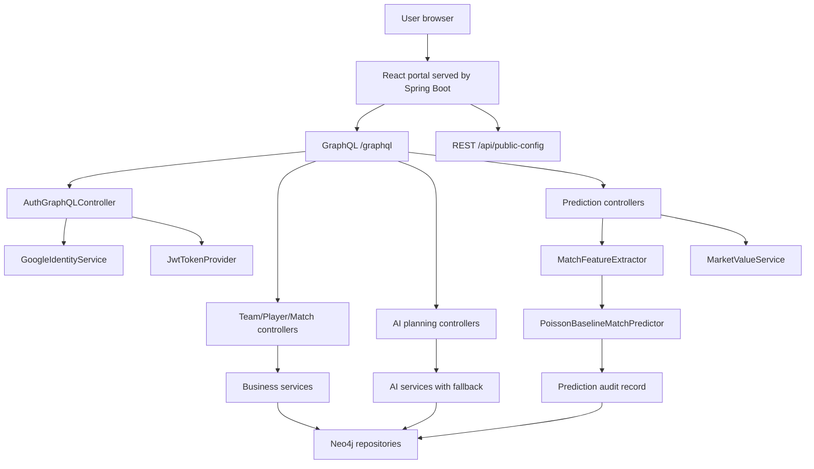

# PitchMind Developer Onboarding Guide

This guide explains PitchMind end to end for a new developer joining the project. It covers what the product does, why the stack was chosen, how the backend and frontend fit together, how data flows through Neo4j and GraphQL, how authentication and authorization work, how the prediction and market algorithms work, how to run and test the app, and where to start when making changes.

## 1. Product Overview

PitchMind is a football intelligence portal for coaches and analysts. The application helps a user manage squads, record fixtures, track player match stats, generate tactical and training outputs, create season workload audits, and run transparent match prediction and market-value workflows.

The product intentionally combines two types of intelligence:

- Deterministic football logic: validation, historical feature extraction, workload calculations, form aggregation, probability modeling, and market math.
- AI-assisted coaching output: tactical analysis, weekly training plans, and season plans. These use an LLM when configured, but every workflow has deterministic fallback behavior so the product remains usable when the AI provider is unavailable.

The current public deployment serves the React app and Spring Boot API from one Render web service:

```text
Browser -> Spring Boot static React app -> /graphql API -> Neo4j AuraDB
                                             |
                                             +-> Google Identity token verification
                                             |
                                             +-> Gemini/OpenAI-compatible AI endpoint when enabled
```

## 2. Repository Map

Important paths:

```text
.
|-- src/main/java/com/ai/coach
|   |-- config              Spring, Neo4j, security, cache configuration
|   |-- controller          GraphQL and public REST endpoints
|   |-- domain              Pure domain helpers, DTOs, entities, repositories
|   |-- service             Business use cases and AI orchestration
|   |-- predictor           Match prediction feature extraction and model
|   |-- betting             Market expected-value calculation
|   |-- security            JWT creation and request authentication
|   `-- exception           Application and GraphQL exception mapping
|-- src/main/resources
|   |-- application.yaml    Main runtime configuration
|   |-- application-prod.yaml
|   `-- graphql/schema.graphqls
|-- src/test/java/com/ai/coach
|   `-- ...                 Backend unit and slice tests
|-- frontend-react
|   |-- src/app             Main React portal and tests
|   |-- src/auth            Auth context, JWT user storage, auth tests
|   |-- src/api             GraphQL client wrapper
|   |-- scripts             Demo seed and smoke walkthrough tooling
|   `-- package.json
|-- Dockerfile              Multi-stage production image
|-- render.yaml             Render service blueprint
|-- build.gradle            Java build plus frontend packaging
`-- docs                    Engineering documentation
```

## 3. Chosen Stack and Why

### Backend: Java 17 and Spring Boot 3.5

Spring Boot gives the project a stable, production-ready backend foundation: dependency injection, configuration binding, validation, security filters, actuator health checks, GraphQL integration, and test support. Java 17 is a conservative LTS runtime that works well on Render and with Neo4j/Spring libraries.

The backend owns all trusted business logic. The frontend does not decide roles, does not calculate final prediction records, and does not directly talk to Neo4j.

### API: Spring GraphQL

GraphQL is used because the frontend needs flexible, screen-shaped reads across teams, players, matches, stats, predictions, plans, and analyses. It lets the React portal request exactly the fields it needs for each panel while keeping one API endpoint: `/graphql`.

The schema lives at:

```text
src/main/resources/graphql/schema.graphqls
```

GraphiQL is enabled for local and deployed exploration at:

```text
/graphiql
```

### Database: Neo4j

Football data is naturally connected: teams have players, matches connect two teams, stats connect players to matches, predictions and analyses connect back to fixtures, and season plans connect teams to workload snapshots. Neo4j gives the code direct graph relationships instead of forcing join-heavy relational mappings for this domain.

Spring Data Neo4j repositories provide the persistence layer. Entity classes use graph annotations and repository interfaces hide most low-level Cypher from services.

### Frontend: React, Vite, TypeScript

The project originally had Angular code, but the active frontend is now the React app in `frontend-react`. React was chosen for the portal because the UI is interactive and state-heavy: tabs, selected teams, forms, prediction results, AI result cards, loading/error states, and auth state all live in one cohesive client application.

Vite gives fast local development and simple static production builds. TypeScript keeps the GraphQL result shapes, component props, auth state, and form data safer during ongoing changes.

### Authentication: Google Identity Services plus backend JWT

The app no longer uses password registration or basic login. Users sign in with Google. The frontend receives a Google ID token, sends it to GraphQL, and the backend verifies it with Google before issuing a PitchMind JWT.

The backend JWT is used for application requests after login. This keeps Google identity verification at the boundary while allowing the app to use normal role-based authorization internally.

### AI Provider: Spring AI with Gemini OpenAI-compatible endpoint

The AI integration goes through Spring AI using Google's Gemini OpenAI-compatible endpoint. This keeps the code provider-aware but still using a standard chat-completions style abstraction.

The app must remain useful without an AI key, so AI services catch provider failures and use deterministic fallback outputs.

### Deployment: Docker on Render

Render runs one Docker web service. The Dockerfile builds React first, then packages the static frontend into the Spring Boot jar. This gives one public URL for the app and API.

Neo4j AuraDB provides the hosted database. Google OAuth provides identity.

## 4. High-Level Architecture



Runtime request pattern:

1. Browser loads `/`.
2. Spring serves the React static bundle from the jar.
3. Auth screen fetches `/api/public-config` to get the Google OAuth client ID at runtime.
4. User signs in with Google.
5. Frontend sends Google ID token to `authenticateWithGoogle`.
6. Backend verifies the token, upserts the user, assigns role, and returns a PitchMind JWT.
7. Frontend stores JWT and user summary in local storage.
8. Future GraphQL requests include `Authorization: Bearer <jwt>`.
9. Spring Security reads the JWT and creates the authenticated principal.
10. Role-protected mutations use `@PreAuthorize`.

## 5. Backend Design

The backend is layered:

- Controller layer: translates GraphQL or REST requests into service calls.
- Service layer: owns use cases, validation orchestration, transactions, AI fallback behavior, and persistence decisions.
- Domain layer: stores entities, small reusable business calculations, DTOs, and repositories.
- Predictor layer: converts match history into features and predictions.
- Betting layer: evaluates odds against model probabilities.
- Security layer: verifies requests and creates JWTs.

This separation matters because each layer has a clear job:

- Controllers should stay thin.
- Services should express business workflows.
- Domain helpers should be deterministic and easy to unit test.
- Predictors should be explainable and versioned.
- Security should be centralized.

## 6. Domain Model

Core graph entities:

- `User`: Google-backed application user. Has email, display name, Google subject, picture URL, and role.
- `Team`: football team with name, league, formation, and players.
- `Player`: belongs to a team; has name, position, optional rating.
- `Match`: connects home and away teams; may have final score or be a future fixture.
- `PlayerMatchStat`: connects a player and match with minutes, goals, assists, cards, and rating.
- `Recommendation`: general recommendation record.
- `MatchAnalysis`: AI or fallback tactical analysis for a match.
- `TrainingPlan`: weekly team plan with `TrainingSession` children.
- `SeasonPlan`: season objectives plus workload snapshots.
- `PlayerWorkloadSnapshot`: calculated recent workload, fatigue, injury risk.
- `MatchPredictionRecord`: persisted prediction audit output.

Important modeling convention:

- A match with `homeGoals` and `awayGoals` is considered completed.
- A match with missing goals is treated as scheduled or pending.
- Prediction history uses only completed matches before the target match date.

## 7. GraphQL API Surface

Main queries:

- `teams`
- `team(id)`
- `playersByTeam(teamId)`
- `match(id)`
- `matchesByTeam(teamId, first, after)`
- `recommendationsByMatch(matchId)`
- `matchAnalysis(matchId)`
- `trainingPlansByTeam(teamId)`
- `seasonPlansByTeam(teamId)`
- `statsByMatch(matchId)`
- `statsByPlayer(playerId, first, after)`
- `playerTrendByLastMatches(playerId, lastN)`
- `playerTrendByDateRange(playerId, from, to)`
- `matchPrediction(matchId)`
- `matchPredictionHistory(matchId)`
- `predictionEvaluationSummary`

Main mutations:

- `authenticateWithGoogle(idToken)`
- `createTeam`
- `createPlayer`
- `recordMatch`
- `recordPlayerMatchStat`
- `generateRecommendation`
- `generateMatchAnalysis`
- `generateTrainingPlan`
- `generateSeasonPlan`
- `generateMatchPrediction`
- `evaluateMarketValue`

Authorization expectations:

- Authentication is required for normal app use.
- Admin-only write operations are protected with role checks.
- Only configured admin emails should receive the `ADMIN` role.
- Everyone else becomes `COACH`.

## 8. Authentication and Admin Rules

Current desired production rule:

```text
Only andokhachatryan986@gmail.com should be ADMIN.
```

This is controlled by:

```text
PITCHMIND_ADMIN_EMAILS=andokhachatryan986@gmail.com
```

The implementation is in `AuthService`:

1. Verify Google ID token with `GoogleIdentityService`.
2. Normalize the Google email to lowercase.
3. Check whether the email exists in `pitchmind.auth.admin-emails`.
4. If present, assign `ADMIN`; otherwise assign `COACH`.
5. Upsert the user by Google subject or email.
6. Generate an app JWT containing subject and role.

Security note:

- Google client ID is public configuration.
- Google client secret is not used by this frontend ID-token flow.
- JWT secret is private and must stay in Render environment variables.
- Existing JWTs remain valid until expiration. If admin access must be revoked immediately, rotate `JWT_SECRET` to force all users to log in again.

## 9. Frontend Design

The frontend is a single React portal composed mostly in `frontend-react/src/app/App.tsx`, supported by auth and API utilities.

Main UI tabs:

- Dashboard: overview metrics and selected team context.
- Teams & Squads: create teams and players, inspect roster.
- Matches & Stats: record fixtures/results and player match stats.
- Prediction Lab: generate transparent match predictions and evaluate betting markets.
- AI Studio: generate match analysis, weekly training plans, and season workload audits.

Auth flow:

1. `AuthScreen` loads Google client ID.
2. Local dev can use `VITE_GOOGLE_CLIENT_ID`.
3. Production uses `/api/public-config`, so the deployed frontend does not depend on Vite seeing environment variables at image build time.
4. Google Identity Services renders the sign-in button.
5. `AuthContext.signInWithGoogle` sends the credential to GraphQL.
6. The returned app JWT and user object are stored through guarded local-storage helpers.

GraphQL client:

- Lives in `frontend-react/src/api/graphqlClient.ts`.
- Sends JSON POST requests to `/graphql` by default.
- Adds `Authorization` header when a JWT is available.
- Throws readable errors for GraphQL or network failures.

Frontend state style:

- The current app is intentionally simple and local-state based.
- Because the portal is one cohesive workflow, there is no global state library yet.
- If the app grows into many independent screens, introduce routing and query caching deliberately, not by default.

## 10. AI Workflows

AI services follow the same pattern:

1. Validate and load required domain data.
2. Build a strict prompt asking for JSON only.
3. Build a deterministic fallback result.
4. Call the AI provider through `AiClient`.
5. Parse response JSON through `AiResponseParser`.
6. If the provider fails or returns weak output, use fallback values.
7. Persist the result to Neo4j.

### Match Analysis

Input:

- Match
- Focus area: `PRESSING`, `BUILD_UP`, `DEFENCE`
- Style: `POSSESSION`, `DIRECT`, `BALANCED`
- Risk: `LOW`, `MEDIUM`, `HIGH`

Output:

- Tactical summary
- Key factors

Fallback:

- Compact tactical advice that respects the selected focus and risk.

### Weekly Training Plan

Input:

- Team
- Week start and end
- Primary focus
- Overall intensity

Validation:

- Dates must use ISO format: `YYYY-MM-DD`.
- `weekEnd` cannot be before `weekStart`.
- Range cannot exceed 7 days.

Output:

- Summary
- Training sessions with date, focus, intensity, duration, and notes

Fallback:

- A 5 to 6 session microcycle:
  recovery at start, peak intensity mid-week, taper near end.

### Season Plan

Input:

- Team
- Season label
- Priority

The service loads all players for the team, checks player stats from the last 28 days, calculates workload snapshots, and asks the AI for season objectives. The fallback gives preparation, competition, transition, rotation, and recovery guidance.

## 11. Prediction Algorithm

The current model is a transparent Poisson baseline. It is intentionally understandable and auditable. It is not a black-box ML model.

### Feature Extraction

`MatchFeatureExtractor` builds a `MatchFeatureSnapshot` for a target fixture.

Rules:

1. Target match must have two different persisted teams.
2. Target match must have a date.
3. Historical data includes only completed matches before the target match date.
4. The target match itself is excluded.
5. Historical matches must have teams, team IDs, scores, and dates.

For each team, the extractor calculates:

- Total completed matches.
- Home and away match counts.
- Goals for per match.
- Goals against per match.
- Home goals for and against per match.
- Away goals for and against per match.
- Recent goals for and against per match over a configurable recent window.

Global league baselines:

- Average home goals across completed historical matches.
- Average away goals across completed historical matches.
- Fallback league average when no global baseline exists.

Data quality:

- `INSUFFICIENT`: not enough global history or not enough team history.
- `LIMITED`: enough team/global history but weak venue-specific sample.
- `SUFFICIENT`: enough global, team, and venue history.

### Expected Goals

Expected home goals blend three signals:

```text
home attack + away defence + global home goals baseline
-------------------------------------------------------
                         3
```

Expected away goals blend three signals:

```text
away attack + home defence + global away goals baseline
-------------------------------------------------------
                         3
```

Attack and defence inputs use venue splits when enough venue data exists. Otherwise they fall back to total team averages.

Recent form is blended into baseline numbers:

```text
baseline * (1 - recentWeight) + recent * recentWeight
```

The final expected goals are clamped between configured minimum and maximum values to avoid unrealistic probabilities from bad or tiny data.

### Poisson Score Matrix

The predictor creates a probability distribution for each possible score from `0` to `maxGoals`:

```text
P(k goals) = e^(-lambda) * lambda^k / k!
```

Then it combines home and away distributions into a score matrix:

```text
P(homeScore, awayScore) = P(homeScore) * P(awayScore)
```

Because the score matrix is truncated at `maxGoals`, probabilities are normalized by the raw matrix total.

From the matrix the app derives:

- Home win probability
- Draw probability
- Away win probability
- Over 2.5 goals probability
- Under 2.5 goals probability
- Both teams to score probability
- Most likely score

The probability validator enforces that home/draw/away probabilities sum to roughly 1 within the configured tolerance.

### Confidence and Uncertainty

Confidence uses sample size plus separation between the top two 1X2 probabilities:

- `HIGH`: enough sample, sufficient data quality, and strong top-vs-second probability separation.
- `MEDIUM`: enough medium sample and moderate separation.
- `LOW`: otherwise.

Uncertainty is inverse:

- High confidence -> low uncertainty
- Medium confidence -> medium uncertainty
- Low confidence -> high uncertainty

### Prediction Versioning

Prediction records are persisted with model name, model version, generated timestamp, feature cutoff timestamp, feature summary, and prediction version. This allows future comparisons when the model changes.

## 12. Market Value Algorithm

`MarketValueService` compares a model probability to bookmaker decimal odds.

Inputs:

- Prediction ID, optional for linking.
- Market: home win, draw, away win, over/under 2.5, both teams to score.
- Model probability.
- Decimal odds.

Validation:

- Probability must be greater than 0 and at most 1.
- Decimal odds must be greater than 1.
- Market is required.

Calculations:

```text
fairOdds = 1 / modelProbability
rawImpliedProbability = 1 / decimalOdds
expectedValue = (modelProbability * decimalOdds) - 1
```

Classification:

- `HIGH_UNCERTAINTY`: model probability is extremely low.
- `POTENTIAL_VALUE`: expected value is at or above the configured threshold.
- `WEAK_VALUE`: expected value is positive but below the strong threshold.
- `NO_VALUE`: expected value is zero or negative.

Important product rule:

- The app explains value math; it does not promise results or betting returns.

## 13. Workload and Form Algorithms

The season workload workflow uses the last 28 days of player match stats.

For each player:

- Count matches.
- Sum minutes.
- Convert minutes into fatigue level.
- Convert fatigue and match count into injury risk.
- Persist a workload snapshot with a human-readable comment.

Player trend workflows aggregate recent or date-range stats:

- Goals
- Assists
- Goal contributions
- Average rating
- Total minutes
- Form indicator such as improving, declining, or stable

These calculations are deterministic domain helpers. Keep them unit-tested when changing thresholds or formulas.

## 14. Runtime Configuration

Main configuration file:

```text
src/main/resources/application.yaml
```

Production overrides:

```text
src/main/resources/application-prod.yaml
```

Key environment variables:

```text
SPRING_PROFILES_ACTIVE=prod
PORT=8080

NEO4J_URI=neo4j+s://your-aura-host.databases.neo4j.io
NEO4J_USERNAME=neo4j
NEO4J_PASSWORD=your-password

JWT_SECRET=long-random-secret-at-least-32-chars
JWT_EXPIRATION_MS=86400000

GOOGLE_CLIENT_ID=your-google-web-client-id.apps.googleusercontent.com
PITCHMIND_ADMIN_EMAILS=andokhachatryan986@gmail.com

GOOGLE_GEMINI_API_KEY=disabled
```

`VITE_GOOGLE_CLIENT_ID` may still be useful for local frontend-only dev, but production should rely on `GOOGLE_CLIENT_ID` exposed through `/api/public-config`.

## 15. Local Setup

Prerequisites:

- Java 17+
- Node.js and npm
- Neo4j running locally or AuraDB credentials
- Optional Gemini API key
- Google OAuth web client ID for sign-in

Backend plus packaged frontend:

```powershell
$env:NEO4J_URI="bolt://127.0.0.1:7687"
$env:NEO4J_USERNAME="neo4j"
$env:NEO4J_PASSWORD="ai-coach"
$env:GOOGLE_CLIENT_ID="your-google-client-id.apps.googleusercontent.com"
$env:PITCHMIND_ADMIN_EMAILS="andokhachatryan986@gmail.com"
$env:GOOGLE_GEMINI_API_KEY="disabled"
.\gradlew.bat bootRun
```

Open:

```text
http://localhost:8080/
http://localhost:8080/graphiql
```

Frontend-only dev:

```powershell
cd frontend-react
npm install
$env:VITE_GOOGLE_CLIENT_ID="your-google-client-id.apps.googleusercontent.com"
npm run dev
```

When using Vite dev server, backend requests should still target the Spring Boot GraphQL endpoint. Check `frontend-react/src/api/graphqlClient.ts` and Vite environment variables if calls go to the wrong URL.

## 16. Seeding and Demo Workflow

The demo seed script is in:

```text
frontend-react/scripts/seed-demo-data.mjs
```

It requires an authenticated token path:

- `PITCHMIND_AUTH_TOKEN`: already issued app JWT.
- `PITCHMIND_GOOGLE_ID_TOKEN`: Google ID token that the script can exchange through the backend.

Run:

```powershell
cd frontend-react
$env:PITCHMIND_AUTH_TOKEN="your-admin-jwt"
npm run demo:seed
```

The script should create realistic teams, players, matches, and stats so prediction readiness is meaningful. The prediction model needs completed historical fixtures before the target fixture date.

## 17. Testing

Full project tests:

```powershell
.\gradlew.bat test
```

Frontend checks:

```powershell
cd frontend-react
npm test
npm run build
```

Smoke script:

```powershell
cd frontend-react
$env:PITCHMIND_AUTH_TOKEN="your-admin-jwt"
npm run smoke:e2e
```

Current test coverage includes:

- Spring application boot test.
- Auth service Google role assignment behavior.
- Team/player/match/stat services.
- Training plan validation and fallback behavior.
- Prediction feature extraction and Poisson predictor behavior.
- Market value classification.
- Prediction evaluation summary.
- Frontend app rendering and auth context storage behavior.

When adding a feature:

1. Add or update GraphQL schema.
2. Add controller method.
3. Add service behavior.
4. Add repository method if needed.
5. Add backend tests for service rules.
6. Add frontend tests for user-visible behavior.
7. Run Gradle and frontend checks.

## 18. Deployment

Production is currently one Render Docker web service.

The Dockerfile has three stages:

1. `frontend-build`: install npm dependencies and build React.
2. `backend-build`: copy backend source and built frontend dist, then build Spring Boot jar.
3. runtime: run the jar on a JRE image.

Render blueprint:

```text
render.yaml
```

Render service health check:

```text
/actuator/health
```

Public app URL:

```text
https://pitch-mind-j6zv.onrender.com/
```

Post-deploy sanity checks:

```powershell
Invoke-WebRequest -UseBasicParsing https://pitch-mind-j6zv.onrender.com/actuator/health

Invoke-WebRequest -UseBasicParsing https://pitch-mind-j6zv.onrender.com/api/public-config

Invoke-WebRequest `
  -UseBasicParsing `
  -Uri https://pitch-mind-j6zv.onrender.com/graphql `
  -Method POST `
  -ContentType "application/json" `
  -Body '{"query":"query { __typename }"}'
```

Expected:

- Health returns `UP`.
- Public config returns the Google client ID.
- GraphQL returns `{"data":{"__typename":"Query"}}`.

If the browser shows an old frontend asset after deploy, hard refresh or use a cache-busting query string. The backend can be correct while the browser still has old static HTML or JS cached.

## 19. Google OAuth Setup

Google Cloud requirements:

- OAuth consent screen configured.
- User type external if public users should log in.
- Publishing status set appropriately.
- Web OAuth client created.
- Authorized JavaScript origin includes the production origin:

```text
https://pitch-mind-j6zv.onrender.com
```

The client ID must be set as:

```text
GOOGLE_CLIENT_ID=...
```

For local Vite frontend-only development:

```text
VITE_GOOGLE_CLIENT_ID=...
```

Do not commit secrets. The Google client ID is not a secret, but JWT secret, Neo4j password, and API keys are secrets.

## 20. Security Best Practices in This Project

Current controls:

- No password registration.
- Google ID token verification on backend.
- JWT authentication for app API calls.
- Role in JWT derived only by backend.
- Admin role allow-listed by email.
- GraphQL mutations can use method-level role checks.
- Public config exposes only safe client configuration.
- Actuator exposes health only.

Rules for future work:

- Never trust frontend role state.
- Never grant admin based on a client-provided role.
- Keep admin email list explicit and short.
- Rotate `JWT_SECRET` if role mistakes need immediate invalidation.
- Keep OAuth origins exact.
- Do not log tokens, passwords, or full authorization headers.
- Do not put secrets into `render.yaml`, README, or frontend `.env` files.

## 21. Error Handling

Application exceptions are mapped through the GraphQL exception handling layer. The intended behavior is:

- Missing entities should become clear not-found errors.
- Invalid inputs should become readable validation errors.
- AI provider failure should normally not fail the user workflow because deterministic fallback exists.
- Authentication failures should produce clear auth errors and force re-login.

When adding new errors, prefer domain-specific exceptions over raw low-level exceptions leaking to GraphQL.

## 22. How to Add Common Features

### Add a New Field to a Domain Object

1. Update the entity class.
2. Update GraphQL schema type/input if it is API-visible.
3. Update service creation/update logic.
4. Update frontend TypeScript type.
5. Update queries/mutations in `App.tsx`.
6. Add tests for default/null behavior.
7. Consider data migration or fallback for existing Neo4j nodes.

### Add a New GraphQL Mutation

1. Add mutation to `schema.graphqls`.
2. Add method to a controller class.
3. Add service method with validation and transaction boundary.
4. Add authorization annotation if it changes data.
5. Add service and controller tests.
6. Add frontend form/action if user-facing.

### Add a New Prediction Feature

1. Add raw calculation in `MatchFeatureExtractor`.
2. Add field to `MatchFeatureSnapshot`.
3. Update feature summary/audit text.
4. Use it in the predictor with a clear formula.
5. Update model version.
6. Add tests for sufficient, limited, and insufficient data.
7. Document how the feature affects expected goals or confidence.

### Add a New AI Output

1. Define GraphQL input and output.
2. Define AI response DTO.
3. Build a strict prompt requesting JSON only.
4. Build deterministic fallback first.
5. Parse and validate AI response.
6. Persist output.
7. Add tests where AI fails and fallback is used.

## 23. Best Practices for This Codebase

Keep these principles:

- Keep controllers thin.
- Put business rules in services or domain helpers.
- Keep prediction logic explainable.
- Version prediction models when formulas change.
- Prefer deterministic fallback over user-visible AI failures.
- Make data quality explicit.
- Validate IDs and date ranges before generating outputs.
- Keep frontend forms defensive and readable.
- Use environment variables for deployment-specific configuration.
- Add tests around edge cases, not only happy paths.

Avoid:

- Password auth returning through the back door.
- Hard-coded admin decisions outside configuration.
- Frontend-only validation for rules the backend must enforce.
- Hidden model changes without model-version updates.
- Unbounded AI output parsing.
- Direct database access from controllers.
- Secrets in documentation or committed files.

## 24. First-Day Walkthrough for a New Developer

Use this sequence to understand the system quickly:

1. Read `AGENTS.md` for clean-code, review, branch, testing, and deployment standards.
2. Read `README.md` for basic purpose and commands.
3. Read `docs/DEVELOPER_ONBOARDING.md`.
4. Read `docs/AGENT_WORKFLOW.md` for reasoning rules, architecture diagrams, and roadmap context.
5. Open `src/main/resources/graphql/schema.graphqls` to understand the API.
6. Open `frontend-react/src/app/App.tsx` and map each tab to GraphQL operations.
7. Open `AuthService`, `GoogleIdentityService`, `EmailConfirmationNotifier`, `JwtTokenProvider`, and `SecurityConfig` to understand auth.
8. Open `MatchFeatureExtractor` and `PoissonBaselineMatchPredictor` to understand prediction.
9. Open `MarketValueService` to understand odds evaluation.
10. Run backend tests.
11. Run frontend tests and build.
12. Start the app locally and create or seed demo data.

Recommended first small task:

- Add a small validation rule or UI field to an existing workflow.

Recommended first medium task:

- Add one prediction explanation factor and test it.

Recommended first larger task:

- Split the React app into feature components while preserving behavior and tests.

## 25. Known Operational Notes

- Render Free can be slow after inactivity because the service spins down.
- Google OAuth may take a short time to propagate changes.
- Browser cache can show an old frontend asset after deploy.
- Prediction quality depends heavily on valid completed match history.
- Demo data must include real teams, players, completed history, and one future target fixture for prediction demos.
- The app can run without Gemini by setting `GOOGLE_GEMINI_API_KEY=disabled`.

## 26. Current Production Invariants

These are project rules that should not change casually:

- Google login is the only supported login path.
- `andokhachatryan986@gmail.com` is the only intended administrator.
- Non-admin Google users are coaches.
- Neo4j is the source of truth.
- Spring Boot serves both API and production frontend.
- Prediction is transparent and auditable.
- AI workflows must have deterministic fallback behavior.
