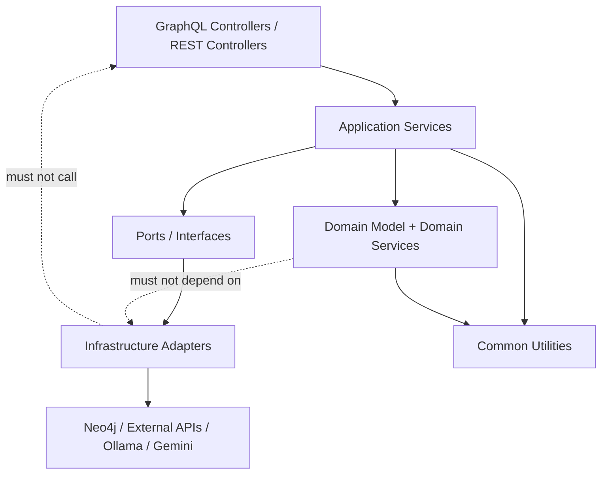
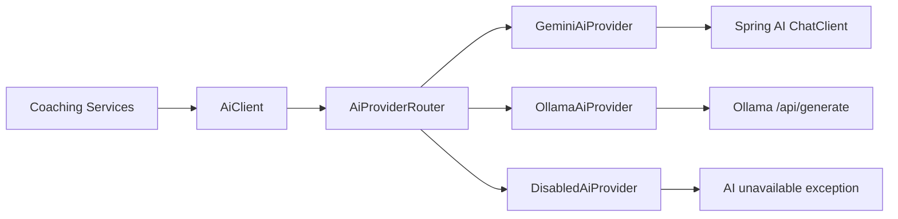

# PitchMind Modular DDD Architecture

This document defines how PitchMind should evolve toward clearer backend and frontend modules while keeping coaching AI, prediction, identity, and AI provider flows separate.

It is a design contract for future implementation. Do not perform a large package rewrite in one PR. Use this document to create small, reviewable tasks.

## 1. Architecture Goal

PitchMind should be easy to understand by domain:

- Coaching: tactical analysis, training plans, season plans, recommendations.
- Prediction: match features, Poisson model, probabilities, confidence, market value.
- AI Provider: Gemini, Ollama, disabled/fallback provider routing.
- Common: reusable infrastructure-free primitives that do not belong to one business domain.

The key rule:

```text
Do not mix business flows just because they use AI.
```

Ollama, Gemini, and future providers are technical adapters. They must not leak into prediction, coaching, or identity domain logic.

## 2. Target Backend Bounded Contexts

```text
com.ai.coach.common
  error
  pagination
  validation
  time
  json
  security

com.ai.coach.ai
  application
  domain
  gemini
  ollama
  disabled

com.ai.coach.coaching
  analysis
  training
  season
  recommendation

com.ai.coach.prediction
  application
  domain
  feature
  model
  audit
  market
  evaluation

com.ai.coach.identity
  application
  domain
  google
  email
  security

```

The current code is not fully organized this way yet. This is the target direction for incremental refactoring.

## 3. Common Module Contract

`common` should contain reusable code that is stable, domain-neutral, and safe to share.

Allowed in `common`:

- cursor pagination primitives
- date/time parsing helpers
- enum parsing helpers
- validation helpers
- JSON parsing utilities
- base exceptions and error codes
- result wrappers where useful
- technical constants that are not domain-specific
- security primitives that are not tied to a specific bounded context

Not allowed in `common`:

- football-specific business rules
- prediction formulas
- training plan rules
- role assignment decisions
- OAuth provider logic
- Ollama/Gemini HTTP details
- Neo4j repositories
- UI-specific DTOs

Good examples:

```text
common.pagination.CursorPaginator
common.validation.InputValidator
common.time.DateRange
common.error.ApplicationException
common.json.JsonResponseParser
```

Bad examples:

```text
common.PredictionCalculator
common.AdminRoleService
common.TrainingPlanFactory
common.OllamaClient
```

If a class needs football language, it probably does not belong in `common`.

## 4. Module Dependency Direction



Dependency rule:

```text
Controller -> Application Service -> Domain -> Ports
Infrastructure implements ports.
Common is allowed downward, never upward.
```

## 5. AI Provider Module

The AI provider module exists so coaching workflows do not care whether output comes from Gemini, Ollama, or fallback mode.

Target classes:

```text
com.ai.coach.ai.domain.AiProvider
com.ai.coach.ai.domain.AiProviderMode
com.ai.coach.ai.domain.AiGenerationRequest
com.ai.coach.ai.domain.AiGenerationResult
com.ai.coach.ai.application.AiProviderRouter
com.ai.coach.ai.application.AiClient
com.ai.coach.ai.gemini.GeminiAiProvider
com.ai.coach.ai.ollama.OllamaAiProvider
com.ai.coach.ai.disabled.DisabledAiProvider
com.ai.coach.ai.config.AiProperties
```

Provider routing:



Prediction should not use this module for probability generation. Prediction is deterministic and provider-independent.

## 6. Coaching Module

Coaching owns the language of football planning:

- tactical summary
- match analysis
- focus area
- playing style
- risk level
- training microcycle
- training session
- season plan
- workload snapshot

Target package shape:

```text
coaching.analysis.MatchAnalysisService
coaching.training.TrainingPlanService
coaching.season.SeasonPlanService
coaching.recommendation.RecommendationService
```

Coaching may call `AiClient`, but it should not know which provider is active.

## 7. Prediction Module

Prediction owns deterministic analytics:

- historical match feature extraction
- expected goals
- Poisson score matrix
- probability normalization
- confidence and uncertainty
- model versioning
- prediction audit
- market value math

Target package shape:

```text
prediction.application.MatchPredictionService
prediction.feature.MatchFeatureExtractor
prediction.model.PoissonBaselineMatchPredictor
prediction.model.PredictionModelProperties
prediction.audit.PredictionAuditMapper
prediction.market.MarketValueService
prediction.evaluation.PredictionEvaluationService
```

Prediction must not know about:

- Gemini
- Ollama
- Spring AI
- frontend tabs

## 8. Identity Module

Identity owns:

- Google sign-in
- email registration
- email confirmation
- app JWT generation
- role assignment
- admin allow-list

Target package shape:

```text
identity.application.AuthService
identity.google.GoogleIdentityService
identity.email.EmailConfirmationNotifier
identity.domain.User
identity.domain.UserRole
identity.security.JwtTokenProvider
```

Role invariant:

```text
Only emails configured in PITCHMIND_ADMIN_EMAILS may become ADMIN.
Every other user must become COACH.
```

## 9. Frontend Module Boundaries

Target frontend shape:

```text
frontend-react/src/features/auth
frontend-react/src/features/dashboard
frontend-react/src/features/coaching
frontend-react/src/features/prediction
frontend-react/src/shared/api
frontend-react/src/shared/ui
frontend-react/src/shared/config
frontend-react/src/shared/types
```

Reusable frontend code belongs in `shared` only when it is domain-neutral.

Allowed in `shared`:

- GraphQL client wrapper
- generic `Panel`, `Metric`, `Badge`, `LoadingState`, `ErrorBanner`
- formatting helpers like percent/date/decimal
- safe local storage helpers
- runtime config loading

Not allowed in `shared`:

- prediction-specific cards
- training plan forms
- auth role decisions

Feature examples:

```text
features/coaching/components/TrainingPlanPanel.tsx
features/coaching/components/MatchAnalysisPanel.tsx
features/coaching/components/SeasonPlanPanel.tsx

features/prediction/components/PredictionLabPage.tsx
features/prediction/components/PredictionCard.tsx
features/prediction/components/MarketValuePanel.tsx
```

## 10. SOLID Rules In This Project

Single Responsibility:

- `TrainingPlanService` generates training plans.
- `MatchPredictionService` generates and loads predictions.
- `OllamaAiProvider` calls Ollama.
- `AiProviderRouter` selects a provider.

Open/Closed:

- Add `OllamaAiProvider` without editing coaching services.
- Add future providers without changing GraphQL schema.

Liskov Substitution:

- Every `AiProvider` must follow the same contract.
- Provider callers should not need `if provider is Ollama` logic.

Interface Segregation:

- Keep generation, health, and metadata interfaces separate if they grow.
- Do not force every provider to implement capabilities that only one provider supports.

Dependency Inversion:

- Application services depend on provider interfaces, not HTTP clients.
- Domain services do not depend on Spring, WebClient, or external APIs.

## 11. Design Patterns To Use

Recommended patterns:

- Strategy: `AiProvider` implementations for Gemini, Ollama, disabled.
- Router/Factory: select provider by configuration.
- Adapter: wrap Spring AI and Ollama HTTP APIs behind the same interface.
- Ports and Adapters: isolate Neo4j, Google, SMTP, Ollama, Gemini.
- Template Method only when prompt workflows truly share sequence and differ in details.
- Value Object: date ranges, model version, confidence, probability values.
- Repository: Neo4j persistence boundaries.

Avoid:

- God service that handles auth, AI, prediction, and persistence.
- Common module dumping ground.
- Provider-specific checks scattered across services.
- Frontend role decisions.
- Refactor PRs that move everything at once.

## 12. Incremental Refactoring Plan

Phase 1: Documentation and contracts.

- Add this architecture document.
- Agree on common/shared boundaries.
- Define Ollama provider contract.

Phase 2: AI provider module.

- Add `AiProvider` interface.
- Add provider modes.
- Move current Gemini behavior behind `GeminiAiProvider`.
- Add `DisabledAiProvider`.
- Add `OllamaAiProvider`.

Phase 3: Keep services stable.

- Preserve existing `AiClient` public methods.
- Make `AiClient` delegate to the provider router.
- Do not change GraphQL schema for this step.

Phase 4: Frontend extraction.

- Extract shared UI components first.
- Extract prediction feature second.
- Extract coaching feature third.

## 13. First Hands-On Task For Senior Developer

Implement one small piece from this design:

```text
Create AiProviderMode enum and AiProperties config class.
Do not change AiClient behavior yet.
Add tests for config binding or enum parsing.
```

Acceptance criteria:

- No behavior change.
- App still starts.
- Tests pass.
- Naming matches this document.

This is a safe first step because it teaches module boundaries without risking production AI flows.

## 14. Review Checklist

Before merging modular architecture work:

- Does the change move only one bounded context at a time?
- Did we avoid changing behavior while moving packages?
- Did all tests pass?
- Did we preserve GraphQL contract?
- Did common/shared stay domain-neutral?
- Did prediction remain independent from LLM providers?
- Did coaching remain independent from specific providers?
- Did frontend role logic stay backend-driven?
