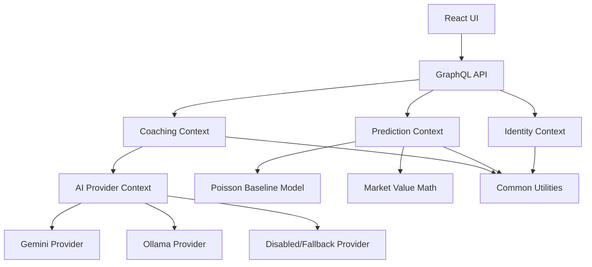

# LinkedIn Article Draft: Building AI Products With DDD, SOLID, and Clean Module Boundaries

## Short Post

I am evolving PitchMind, my football intelligence platform, toward a modular DDD architecture.

The key lesson so far: not every AI feature belongs in the same "AI module".

In my system I separate:

- Coaching workflows: tactical analysis, training plans, season planning.
- Prediction workflows: deterministic feature extraction, Poisson model, probability, confidence, market value.
- AI provider infrastructure: Gemini, Ollama, disabled fallback mode.
- Common/shared code: only domain-neutral reusable primitives.

The most important rule:

```text
Do not mix business flows just because they all use AI.
```

Prediction should not know about Ollama.
Coaching should not know HTTP details.
Frontend should not decide backend roles.

That is where DDD and SOLID become practical, not theoretical.

DDD gives the language and boundaries.
SOLID keeps the code changeable.
Design patterns such as Strategy, Adapter, Router, Ports and Adapters make provider switching possible without rewriting the product.

My next step is adding local AI mode with Ollama:

```text
gemini   -> cloud AI provider
ollama   -> local AI provider
disabled -> deterministic fallback
```

The goal is simple: make the product useful even without cloud AI keys, while keeping architecture clean enough to grow.

#Java #SpringBoot #SpringAI #DDD #SOLID #CleanArchitecture #Ollama #LocalAI #GraphQL #Neo4j #React #AIEngineering #SoftwareArchitecture

## Long Article

### Why I Am Refactoring Toward Bounded Contexts

AI products become messy fast when every feature is placed under one broad "AI" label.

In PitchMind, I have several different kinds of intelligence:

- AI-generated coaching output.
- Deterministic match prediction.
- Market value math.
- Cloud and local AI provider integration.

These are not the same problem.

A training plan and a probability model can both feel like "AI" from the user perspective, but from an engineering perspective they have different rules, data, risks, and tests.

That is why I am moving toward modular DDD boundaries.

### The Architecture Direction



### The Important Separation

Coaching is about football decisions:

- tactical analysis
- microcycles
- season planning
- workload guidance

Prediction is about deterministic analytics:

- match history
- feature extraction
- expected goals
- Poisson score matrix
- confidence
- market value

AI provider infrastructure is about execution:

- Gemini
- Ollama
- disabled fallback
- provider routing

Common is not a dumping ground. It is only for reusable, domain-neutral primitives.

### Where SOLID Helps

Single Responsibility:

Each service should do one job. `OllamaAiProvider` calls Ollama. `MatchPredictionService` generates predictions. `TrainingPlanService` generates training plans.

Open/Closed:

I should be able to add Ollama without editing every coaching service.

Liskov Substitution:

Every AI provider should follow the same contract.

Interface Segregation:

Generation, health checks, and metadata can be separate contracts.

Dependency Inversion:

Application services should depend on abstractions, not HTTP clients or cloud provider SDKs.

### Design Patterns That Fit

Strategy:

```text
AiProvider
  -> GeminiAiProvider
  -> OllamaAiProvider
  -> DisabledAiProvider
```

Adapter:

Wrap Gemini/Spring AI and Ollama HTTP APIs behind one project contract.

Router/Factory:

Select provider by configuration:

```text
PITCHMIND_AI_PROVIDER=gemini|ollama|disabled
```

Ports and Adapters:

Keep external systems outside the domain:

- Neo4j
- Google OAuth
- SMTP
- Gemini
- Ollama

### Why Local AI With Ollama Matters

Cloud AI is useful, but a product should not stop working when a key is missing or a provider is unavailable.

Ollama gives me a local mode:

```text
OLLAMA_BASE_URL=http://localhost:11434
OLLAMA_MODEL=llama3.1:8b
```

The product can support:

```text
gemini   -> cloud mode
ollama   -> local mode
disabled -> deterministic fallback
```

This is not only cheaper and more private. It is also a better engineering exercise.

### The Main Rule I Am Keeping

```text
Prediction should not know Ollama exists.
```

Prediction remains transparent and deterministic.

### Practical Takeaway

DDD is not about folders.

DDD is about protecting language, rules, and boundaries.

SOLID is not about ceremony.

SOLID is about making the next change cheaper and safer.

In AI products, this matters even more because it is easy to mix prompts, providers, business rules, UI state, and persistence into one large system that nobody can safely modify.

My next implementation step is small:

```text
Create AiProviderMode and AiProperties.
No behavior change.
No provider rewrite yet.
Tests pass.
```

That is how I want to grow the architecture: one clear boundary at a time.

## Graphic Brief

Use the Mermaid architecture diagram above as the main visual. If creating a generated image, use this prompt:

```text
Create a clean software architecture diagram for an AI football intelligence platform. Show React UI and GraphQL API at the top, then separate bounded contexts: Coaching, Prediction, Identity, AI Provider, and Common Utilities. Show AI Provider branching into Gemini, Ollama, and Disabled/Fallback. Use a modern technical style, white background, crisp boxes, thin connector lines, blue/green accent colors, no mascots, no decorative blobs, readable labels.
```

## Hands-On Learning Exercise

Implement the smallest architecture step:

```text
Add AiProviderMode enum and AiProperties config.
Do not change runtime behavior yet.
```

Acceptance criteria:

- The app still starts.
- Existing AI workflows behave the same.
- Tests pass.
- Naming matches the modular architecture document.

This is a good first exercise because it teaches DDD boundaries, SOLID dependency direction, and safe incremental refactoring.
