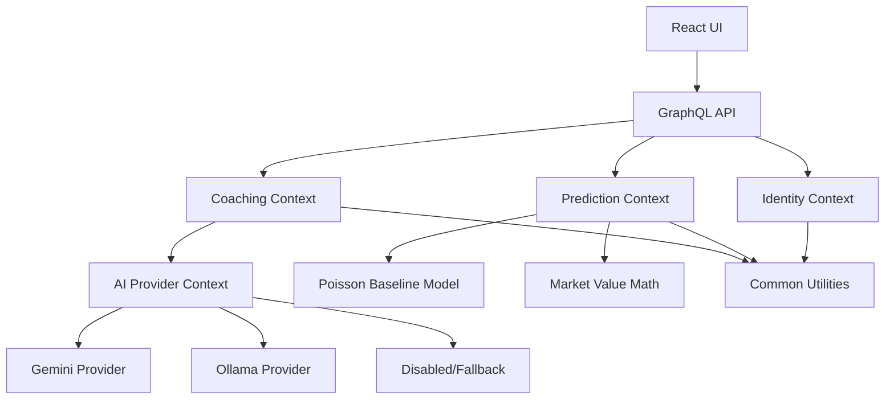

# LinkedIn Post: DDD, SOLID, and Modular AI Product Architecture

## Ready-To-Post Version

I am refactoring PitchMind, my football intelligence platform, with one architecture rule in mind:

```text
Do not mix business flows just because they all use AI.
```

In the product, I separate four different concerns:

- Coaching workflows: tactical analysis, training plans, season planning, workload guidance.
- Prediction workflows: historical data, feature extraction, Poisson baseline, confidence, market value.
- AI provider infrastructure: Gemini, Ollama, disabled fallback mode.
- Common/shared code: only reusable, domain-neutral primitives.

This distinction matters.

Prediction should not know that Ollama exists.
Coaching should not know HTTP details.
Frontend should not decide backend roles.
Common should not become a dumping ground.

That is where DDD, SOLID, and design patterns become practical.

DDD protects the language and boundaries:

```text
coaching -> plans, sessions, workload, tactical advice
prediction -> features, probabilities, model version, confidence
identity -> users, roles, Google sign-in, email confirmation
ai provider -> model, prompt, provider, response, fallback
common -> pagination, validation, dates, JSON, errors
```

SOLID keeps the next change cheap:

- Single Responsibility: one service, one reason to change.
- Open/Closed: add Ollama without rewriting coaching services.
- Dependency Inversion: application code depends on provider contracts, not HTTP clients.

The next implementation step is intentionally small:

```text
Add AiProviderMode and AiProperties.
No behavior change.
No provider rewrite.
Tests pass.
```

This is how I want to grow the project: one clear boundary at a time.

#Java #SpringBoot #SpringAI #DDD #SOLID #CleanArchitecture #Ollama #LocalAI #GraphQL #Neo4j #React #AIEngineering #SoftwareArchitecture

## Visual Asset

Use this image with the post:

```text
docs/articles/assets/ddd-solid-ai-architecture.svg
```

## Optional Longer Article

AI products become messy fast when every feature is placed under one broad "AI" module.

PitchMind has several kinds of intelligence, but they are not the same engineering problem.

A training plan can be generated by an LLM. A match prediction should be calculated by a deterministic or trained model. A market value result is math. Authentication is a security concern. Provider routing is infrastructure.

Putting all of that into one module would make the system harder to test, explain, and extend.

The architecture direction is:



The AI provider module is a technical adapter layer. It will let the product run in different modes:

```text
gemini   -> cloud AI
ollama   -> local AI
disabled -> deterministic fallback
```

But the provider must not leak into business modules.

Coaching can ask for generated tactical or training output, but it owns validation, fallback, and persistence.

Prediction owns features, probabilities, confidence, model versioning, and evaluation. It does not ask an LLM to invent probability numbers.

Identity owns roles, login, email confirmation, and JWT issuing. The frontend never decides who is admin.

Common stays small and boring: pagination, validation, date helpers, JSON parsing, and base errors. If a class needs football language, it probably does not belong in common.

The design patterns are simple but powerful:

- Strategy for AI providers.
- Adapter for Gemini and Ollama APIs.
- Router/Factory for provider selection.
- Ports and Adapters for external systems.
- Repository for Neo4j persistence boundaries.

The first implementation task is deliberately small:

```text
Create AiProviderMode enum and AiProperties config class.
Do not change AiClient behavior yet.
```

That is the point of clean architecture: move in small steps without breaking production behavior.

## Graphic Prompt Backup

If a generated image is needed later, use this prompt:

```text
Create a clean software architecture diagram for an AI football intelligence platform. Show React UI and GraphQL API at the top, then separate bounded contexts: Coaching, Prediction, Identity, AI Provider, and Common Utilities. Show AI Provider branching into Gemini, Ollama, and Disabled/Fallback. Use a modern technical style, white background, crisp boxes, thin connector lines, blue/green accent colors, no mascots, no decorative blobs, readable labels.
```
