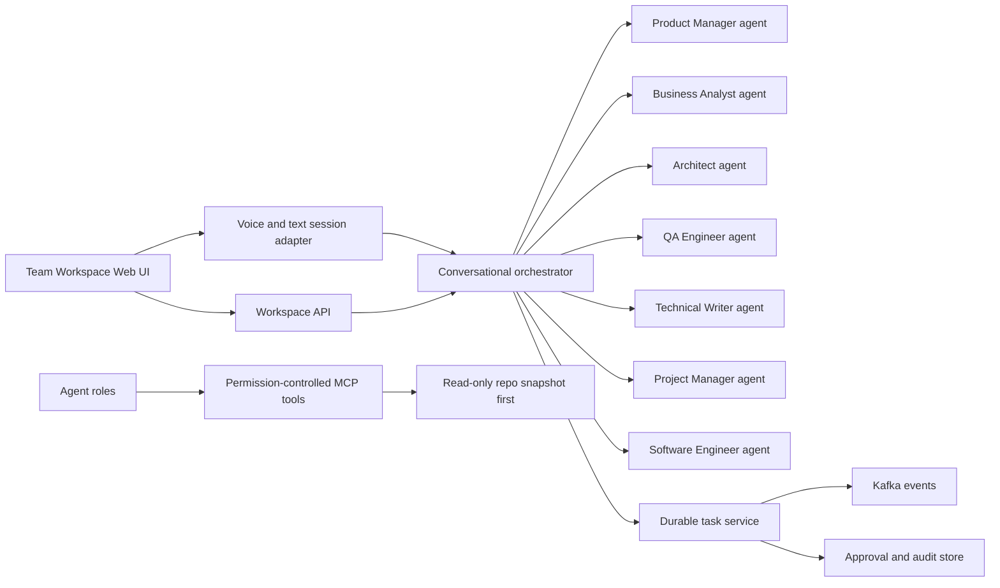
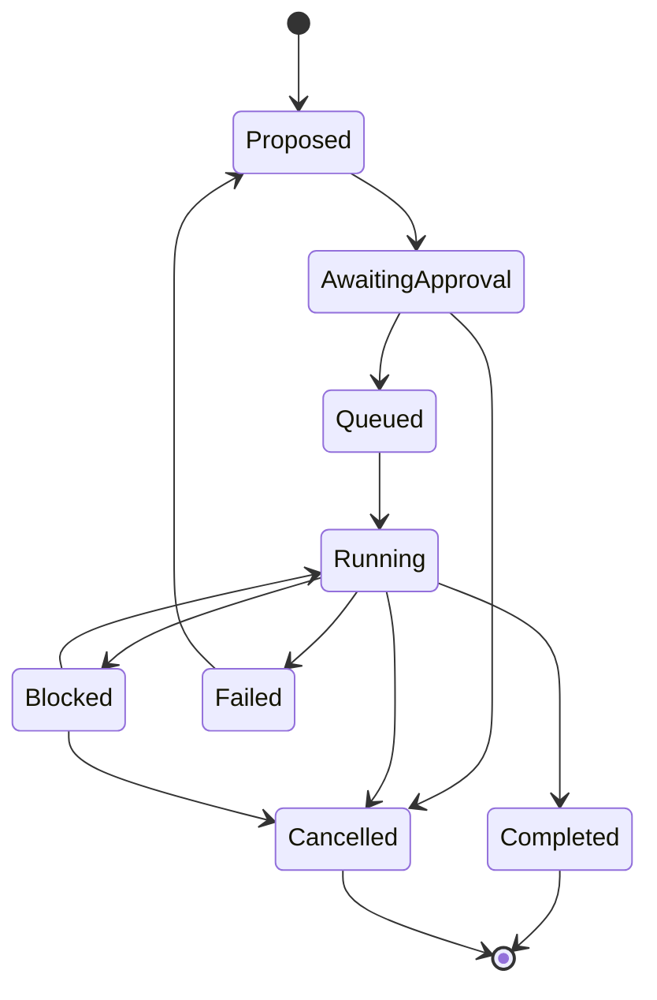

# AI Team Workspace Tasks

This plan is for the future internal AI Team Workspace, not for the PitchMind football runtime.

The workspace will let the user collaborate with specialized AI roles by voice and text. It can later help plan and review PitchMind work, but only through explicit permissions and scoped tasks.

## Preservation Rule

No removes. This workstream must not delete PitchMind files or edit existing PitchMind runtime logic. The first workspace tasks are discovery and design only; implementation begins in separate workspace-owned paths after approval.

## Go Implementation Direction

Updated direction from 2026-09-03:

- Implement new AI Team Workspace backend services primarily in Go.
- Use this workstream as the user's step-by-step Go learning path, starting from fundamentals and moving into real service implementation.
- Keep the frontend direction as React/TypeScript unless separately changed.
- Keep service boundaries independent from PitchMind runtime code.
- Use Go where it gives practical value: concurrent task workers, MCP/A2A servers, tool execution gateways, event consumers, approval/audit APIs and small deployable services.
- Do not migrate the current PitchMind Java backend as part of the first workspace milestone.
- If a service needs Java/Spring AI specifically, document the reason and contract before choosing Java for that service.

Initial Go service candidates:

```text
services/team-workspace/orchestrator
services/team-workspace/task-service
services/team-workspace/approval-service
services/team-workspace/mcp-gateway
services/team-workspace/event-worker
```

## Go Learning Method

Each Go task should teach one concept and apply it immediately inside the AI Team Workspace.

Working loop:

```text
1. Explain the concept.
2. Define a tiny implementation task.
3. User writes the code.
4. Run tests.
5. Review the code for correctness, naming, error handling and simplicity.
6. Record what was learned.
7. Move to the next slice.
```

Learning order:

```text
Go syntax -> packages/modules -> structs/interfaces -> errors -> context -> HTTP APIs
-> JSON validation -> tests -> concurrency -> persistence -> events -> MCP/A2A adapters
-> production readiness
```

## Source Handling

The file `AI-Team-Workspace-Development-Prompt.md` is used as internal workspace planning context. It does not authorize edits to PitchMind product code.

The file `PitchMind-Architecture-Development-Prompt.md` remains the football product workstream. The two workstreams share one monorepo and engineering standards, but they must not share runtime responsibilities.

## User Role

The user is:

- product owner
- final decision-maker
- senior developer writing the code step by step

AI roles support the user. They do not approve their own work, merge code, deploy, spend money or access external systems without explicit approval.

## Target Roles

The first-class AI roles are:

- Product Manager
- Business Analyst
- Architect
- QA Engineer
- Technical Writer
- Project Manager
- Software Engineer

The Software Engineer role is an assistant role in the workspace. It does not replace the user as senior developer.

## Architecture Map



## Target Repository Areas

These paths are proposed future paths. They should be created only when we start this workstream.

```text
apps/team-workspace-web/
services/team-workspace/
agents/team/
contracts/team-workspace/
infra/team-workspace/
docs/team-workspace/
```

Forbidden for this workstream unless separately approved:

```text
apps/pitchmind-web/
services/pitchmind/
contracts/pitchmind/
infra/pitchmind/
docs/pitchmind/
current PitchMind runtime packages
```

## Working Modes

### Direct Conversation

The user selects one role and asks questions.

Acceptance criteria:

- The selected role is visible.
- The answer includes evidence and assumptions.
- The role cannot perform writes without approval.

### Moderated Team Meeting

The user invites multiple roles. A facilitator manages turns, decisions and open questions.

Acceptance criteria:

- Only one role speaks at a time.
- Output includes decisions, disagreements, proposed tasks and evidence.
- Drafts are clearly separate from approved records.

### Work Assignment

The user gives a concrete task with repository, branch, scope, budget and acceptance criteria.

Acceptance criteria:

- Task is proposed before execution.
- Human approval is required before writes.
- QA verifies the exact revision.

## Task State Machine



## Definition Of Done

Every workspace task is done only when:

- Role contracts exist.
- Permissions are explicit.
- Tool access is least privilege.
- The system records decisions, approvals and evidence.
- Private reasoning is not exposed as a work log.
- Voice and text workflows have fallback behavior.
- QA evidence includes revision, environment, commands and limitations.

## Phase 0 - Go Learning Foundation

### Task W0.1 - Go Workspace Architecture Decision

Objective: define how Go will be used for the AI Team Workspace before implementation starts.

Learning goals:

- Go project structure.
- HTTP APIs in Go.
- Goroutines, context cancellation and worker pools.
- Clean architecture in Go.
- Service contracts before implementation.

Scope:

- Decide Go module layout.
- Choose API style for workspace services.
- Define service boundaries for orchestrator, task service, approval service, MCP gateway and event workers.
- Decide how React frontend calls the workspace backend.
- Decide where AI provider adapters live.

Acceptance criteria:

- ADR explains why Go is selected for workspace services.
- ADR lists services that will be implemented in Go.
- ADR lists exceptions where Java would still be allowed.
- No PitchMind runtime code changes.

### Task W0.2 - Go Basics Through A Tiny Workspace Service

Objective: learn Go fundamentals by creating the smallest possible workspace service.

Learning goals:

- `go mod init`
- package naming
- `main.go`
- structs
- interfaces
- errors
- table-driven tests
- simple HTTP health endpoint

Scope:

- Create a tiny Go service under a workspace-owned path after approval.
- Add `/health`.
- Add one domain struct for an AI role definition.
- Add tests for role validation.

Out of scope:

- No database.
- No Kafka.
- No AI provider calls.
- No PitchMind runtime integration.

Acceptance criteria:

- `go test ./...` passes for the new workspace service.
- Service starts locally.
- `/health` returns a stable JSON response.
- No existing PitchMind Java or React logic is changed.

### Task W0.3 - Go HTTP Task API Skeleton

Objective: learn Go HTTP APIs by modeling a small task proposal endpoint.

Learning goals:

- HTTP handlers.
- Request/response DTOs.
- JSON decoding and encoding.
- validation.
- status codes.
- error responses.

Scope:

- Add a `POST /tasks/proposals` endpoint in the new workspace service.
- Store proposals in memory only.
- Validate title, workstream, objective and acceptance criteria.

Out of scope:

- No persistent database yet.
- No GitHub writes.
- No agent execution.

Acceptance criteria:

- Valid request creates an in-memory task proposal.
- Invalid request returns `400` with a clear error.
- Tests cover success and validation failure.
- No existing PitchMind runtime logic is changed.

## Phase 1 - Discovery And Design

### Task W1.1 - Repository Discovery

Objective: verify the monorepo state before creating workspace code.

Learning goals:

- Monorepo boundaries.
- Build discovery.
- Safe inspection workflow.

Scope:

- Inspect root build files, docs, CI and existing application paths.
- Identify which paths are PitchMind and which are available for workspace work.

Acceptance criteria:

- Discovery report names current branch, relevant versions and safe build commands.
- No application code is changed.

### Task W1.2 - Workspace Scope Contract

Objective: make sure the internal workspace does not become mixed with PitchMind.

Learning goals:

- Product boundary.
- Runtime isolation.
- Path ownership.

Scope:

- Define owned paths.
- Define forbidden sibling edits.
- Define local startup independence.

Acceptance criteria:

- PitchMind can run without the workspace.
- Workspace can run with mock project adapters.
- Shared files require explicit impact assessment.

### Task W1.3 - Seven Agent Contracts

Objective: define each AI role as a real contract, not only a personality prompt.

Learning goals:

- Agent contract design.
- Permission policy.
- Evaluation criteria.

Scope:

- Purpose.
- Exclusions.
- Inputs.
- Structured outputs.
- Allowed tools.
- Access scopes.
- Retention.
- Budgets.
- Approval rules.
- Failure behavior.
- Evaluation cases.

Acceptance criteria:

- All seven roles have separate contracts.
- Agents cannot approve their own work.
- Tool permissions are role-specific.

## Phase 2 - Voice Team Room

### Task W2.1 - UX Flow Design

Objective: design the first workspace screens before implementation.

Learning goals:

- Product thinking.
- Accessibility.
- Conversation UX.

Scope:

- Team roster.
- Voice/chat room.
- Project knowledge browser.
- Task list.
- Artifact review.
- Approval inbox.
- Activity/audit view.

Acceptance criteria:

- User can understand who is speaking.
- User can cancel or interrupt.
- Drafts and approved records are visually distinct.

### Task W2.2 - Voice Architecture Decision

Objective: choose the initial voice approach.

Learning goals:

- Realtime speech-to-speech.
- Speech-to-text to agent to text-to-speech.
- Latency and audit tradeoffs.

Scope:

- Compare OpenAI Realtime and STT-agent-TTS.
- Decide where transcripts are stored.
- Decide how short-lived browser credentials are issued.

Acceptance criteria:

- Audio transport is not Kafka.
- Durable work is tracked by backend tasks/events.
- Consequential spoken actions require confirmation.

### Task W2.3 - Read-Only Project Context

Objective: let agents inspect approved project context without changing code.

Learning goals:

- MCP tool boundary.
- Read-only adapters.
- Provenance and source grounding.

Scope:

- Repository snapshot at known commit.
- Documentation search.
- Test result ingestion.

Acceptance criteria:

- Every answer can cite source or mark assumptions.
- Retrieved text cannot grant permissions.
- Workspace works when PitchMind is offline.

## Phase 3 - Durable Task Coordination

### Task W3.1 - Task Lifecycle API

Objective: implement durable proposed, approved, running and completed tasks.

Learning goals:

- State machines.
- Idempotency.
- Optimistic concurrency.

Scope:

- Task aggregate.
- Legal transitions.
- Approval binding.
- Evidence records.

Acceptance criteria:

- Invalid state transitions are rejected.
- Replayed commands do not duplicate side effects.
- Task completion requires evidence.

### Task W3.2 - Event Envelope And Kafka Design

Objective: define event contracts before distributed processing.

Learning goals:

- Kafka topics.
- Correlation and causation IDs.
- Retry and dead-letter handling.

Scope:

- Event envelope.
- Topic ownership.
- Consumer groups.
- Ordering scope.
- Replay policy.

Acceptance criteria:

- No universal exactly-once claim.
- Duplicate delivery is handled.
- Poison messages have a recovery plan.

### Task W3.3 - Approval And Audit Store

Objective: make human approval durable and precise.

Learning goals:

- Security.
- Least privilege.
- Audit design.

Scope:

- Approval object.
- Expiration.
- Bound target, branch, diff or parameters.
- Execution result evidence.

Acceptance criteria:

- Changed parameters require renewed approval.
- Approval survives retries and restarts.
- Agents cannot approve their own work.

## Phase 4 - Approved Action Layer

### Task W4.1 - Isolated Engineering Workspace

Objective: allow approved code work in a contained workspace.

Learning goals:

- Branch isolation.
- Resource limits.
- Safe tool execution.

Scope:

- Disposable workspace.
- CPU/time/storage/network limits.
- No broad host credentials.

Acceptance criteria:

- Work happens only on approved target.
- External writes remain disabled until approved.
- QA can inspect exact revision.

### Task W4.2 - QA Execution Evidence

Objective: make QA reports evidence-based.

Learning goals:

- Test reporting.
- Reproducibility.
- Limitations.

Scope:

- Test command capture.
- Exit codes.
- Logs and artifacts.
- Environment summary.

Acceptance criteria:

- QA report never claims unrun tests.
- Failures include reproduction steps.

## Phase 5 - Delivery Workflow

### Task W5.1 - Pull Request Proposal Flow

Objective: prepare PRs only after approved implementation and QA evidence.

Learning goals:

- Review separation.
- CI evidence.
- Release discipline.

Scope:

- PR description generation.
- Change summary.
- Test evidence.
- Open questions.

Acceptance criteria:

- Authoring, QA and final approval are separate.
- Deployment remains a separate approval.

### Task W5.2 - Workspace Operations

Objective: document how to run, monitor and control cost.

Learning goals:

- Observability.
- SLOs.
- Cost budgets.
- Rollback.

Scope:

- Logs.
- Traces.
- Task stalls.
- Provider failures.
- Token and audio limits.

Acceptance criteria:

- Operators can see stuck tasks.
- Long jobs report async status.
- Seven paid sessions are not kept active unnecessarily.

## First Task To Start

Start with `Task W0.1 - Go Workspace Architecture Decision`, then `Task W0.2 - Go Basics Through A Tiny Workspace Service`.

Reason:

- It makes Go the learning path from the beginning.
- It prevents random service creation before boundaries are clear.
- It keeps PitchMind stable while the workspace is implemented separately.

Implementation contract:

```text
Write the Go workspace architecture decision first.
Then create the smallest Go service only in a workspace-owned path after approval.
Do not edit PitchMind runtime code.
Do not commit, push or deploy.
Ask for review before the first implementation slice.
```
