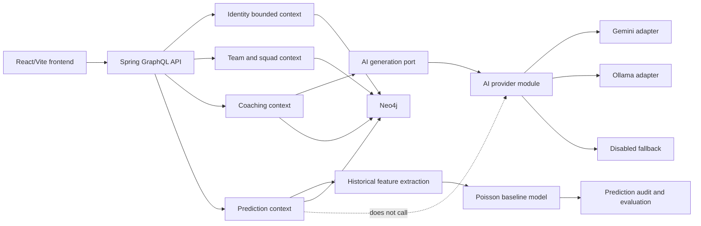

# PitchMind Redesign Tasks

This plan is for the PitchMind football product only. It uses the same architectural discipline as the AI Team Workspace plan, but it must not implement the internal agent meeting room, voice workspace, engineering task board or AI team runtime.

The goal is to redesign PitchMind step by step while preserving the working product.

## Preservation Rule

No removes. Do not delete existing files, features or runtime logic as part of planning. During implementation, touch existing logic only when a task explicitly names the target file, expected behavior, tests and rollback path. Refactoring must be behavior-preserving unless a product change is approved.

## Source Handling

The file `PitchMind-Architecture-Development-Prompt.md` is used as product architecture context. It is not executed blindly. Every implementation task still needs a scoped decision, code review and passing tests.

The separate `AI-Team-Workspace-Development-Prompt.md` is not PitchMind product scope. It may inspire our working method, but its runtime features belong to a different workstream.

## Current Product Baseline

Observed repository shape:

- Backend: Java 17, Spring Boot, GraphQL and Neo4j.
- Frontend: React, Vite and TypeScript under `frontend-react`.
- Production packaging: React is built and served by Spring Boot.
- Product domains already present: identity, teams, players, matches, coaching, prediction, market value, evaluation and AI generation fallback.
- Documentation already present: modular DDD notes, LinkedIn post series, public docs hub and current PitchMind logo.

Target direction:

- Keep PitchMind as the football intelligence product.
- Keep coaching, prediction, identity and AI provider logic separate.
- Move toward DDD modules with clear names and small, reviewable changes.
- Preserve current behavior while refactoring.
- Prepare for future Spring AI provider routing and local Ollama usage without coupling prediction to LLM providers.
- Keep the current Java backend stable until the AI Team Workspace is finished.
- After the workspace is finished, evaluate heavy backend capabilities for migration to Go based on measurable value.

## Architecture Map



## Module Contract

Backend target modules:

```text
com.ai.coach.common
com.ai.coach.identity
com.ai.coach.team
com.ai.coach.coaching
com.ai.coach.prediction
com.ai.coach.ai
```

Frontend target modules:

```text
frontend-react/src/features/auth
frontend-react/src/features/dashboard
frontend-react/src/features/team
frontend-react/src/features/coaching
frontend-react/src/features/prediction
frontend-react/src/shared/api
frontend-react/src/shared/ui
frontend-react/src/shared/config
frontend-react/src/shared/types
```

Dependency rule:

```text
controller -> application -> domain -> ports
infrastructure implements ports
shared/common contains only domain-neutral utilities
```

## Definition Of Done

Every implementation task is done only when:

- The task changes one clear capability or boundary.
- Existing behavior is preserved unless the task explicitly changes it.
- Backend tests pass.
- Frontend build or tests pass when frontend code changes.
- GraphQL contract is not broken accidentally.
- Admin role assignment remains backend-enforced.
- Prediction remains deterministic and independent from AI providers.
- Coaching may use AI generation, but only through a provider-neutral port.
- Documentation is updated when architecture or setup changes.

## Phase 1 - Stabilize The Product

### Task P1.1 - Verify Production Runtime

Objective: establish a repeatable health check for Render, Neo4j Aura and the public app.

Learning goals:

- Spring profiles and environment variables.
- Health endpoints and GraphQL smoke queries.
- Difference between local and production configuration.

Scope:

- Document the exact production smoke-test URLs and GraphQL operations.
- Verify backend health, frontend load, auth config and a simple team query.
- Add a small smoke script only if it does not require secrets committed to the repo.

Out of scope:

- No provider migration.
- No database migration.

Acceptance criteria:

- Public app loads.
- GraphQL endpoint responds.
- Neo4j-backed team query succeeds or returns a clearly diagnosed configuration error.
- Failure messages are actionable.

Review questions:

- Which environment variable would break Neo4j connectivity?
- What is the fastest way to prove frontend and backend are using the same deployed revision?

### Task P1.2 - Lock Down Identity Roles

Objective: keep normal registration and Google sign-in while guaranteeing only configured emails can become admin.

Learning goals:

- Spring Security.
- OAuth identity mapping.
- Role invariants.
- Backend authorization versus frontend visibility.

Scope:

- Confirm `PITCHMIND_ADMIN_EMAILS` controls admin assignment.
- Confirm normal users can register as supported non-admin roles only.
- Add tests for email registration, Google sign-in and forbidden admin self-selection.

Out of scope:

- No new identity provider.
- No manual database role editing flow.

Acceptance criteria:

- `andokhachatryan986@gmail.com` can be admin when configured.
- Any other email cannot become admin through registration payloads.
- Frontend does not expose admin selection for public registration.
- Backend rejects forged admin role attempts.

### Task P1.3 - Email Confirmation Reliability

Objective: make email registration clear locally and safe in production.

Learning goals:

- SMTP configuration.
- Environment-driven behavior.
- Test doubles and production safety.

Scope:

- Confirm local/dev logs show confirmation links only for localhost/dev.
- Confirm production requires SMTP settings before email registration is enabled.
- Improve user-facing error copy for missing SMTP.

Acceptance criteria:

- Local developer can register and confirm using logged token link.
- Production does not pretend to send mail when SMTP is missing.
- Tests cover both local fallback and production rejection.

## Phase 2 - DDD Refactoring Without Behavior Change

### Task P2.1 - Architecture Package Inventory

Objective: create an evidence-based package inventory before moving code.

Learning goals:

- DDD bounded contexts.
- Package dependencies.
- Behavior-preserving refactoring.

Scope:

- Map each existing backend class to target module.
- Map each frontend file to target feature/shared folder.
- Identify shared/common candidates.

Acceptance criteria:

- No code movement yet.
- Inventory lists current path, target path and reason.
- Ambiguous files are marked for discussion.

### Task P2.2 - Common Module First Slice

Objective: move only domain-neutral helpers into `common`.

Learning goals:

- SOLID Single Responsibility.
- Avoiding common-module dumping grounds.
- Refactoring with tests.

Scope:

- Candidate classes: cursor pagination and enum parsing.
- Update imports only where needed.
- Preserve behavior.

Acceptance criteria:

- Tests pass.
- No football-specific business rules are moved to common.
- Public GraphQL behavior is unchanged.

### Task P2.3 - Identity Module Extraction

Objective: make auth and role behavior easy to understand by package names.

Learning goals:

- Security boundary naming.
- OAuth adapter versus domain role rules.
- Ports and adapters.

Scope:

- Move auth service, Google identity service, confirmation notifier and JWT classes into identity/security packages incrementally.
- Keep GraphQL schema stable.

Acceptance criteria:

- Existing auth tests pass.
- Admin invariant tests pass.
- Frontend auth still works.

### Task P2.4 - Coaching Module Extraction

Objective: separate match analysis, training plan, season plan and recommendations from provider details.

Learning goals:

- Application services.
- Deterministic fallback.
- AI port usage.

Scope:

- Rename/package coaching classes into clear subdomains.
- Keep prompt construction and fallback owned by coaching.
- Keep provider selection outside coaching.

Acceptance criteria:

- Training plan generation works with AI disabled.
- Match analysis works with deterministic fallback.
- No coaching class imports provider-specific Gemini or Ollama classes.

### Task P2.5 - Prediction Module Extraction

Objective: keep prediction as deterministic numerical analytics.

Learning goals:

- Feature extraction.
- Poisson baseline model.
- Model evaluation.
- Audit mapping.

Scope:

- Move prediction, feature, model, audit, evaluation and market classes into the target prediction module.
- Keep AI providers out of prediction.

Acceptance criteria:

- Prediction tests pass.
- Market value tests pass.
- Prediction code has no dependency on Spring AI, Gemini or Ollama.

## Phase 3 - AI Provider Boundary

### Task P3.1 - Define Provider Contract

Objective: introduce provider configuration without changing runtime behavior.

Learning goals:

- Strategy pattern.
- Configuration properties.
- Dependency inversion.

Scope:

- Add `AiProviderMode`.
- Add `AiProperties`.
- Keep existing `AiClient` behavior unchanged.

Acceptance criteria:

- Config binding or enum tests pass.
- Existing AI generation tests still pass.
- Naming matches the modular architecture document.

### Task P3.2 - Provider Router

Objective: make provider selection explicit.

Learning goals:

- Router/factory pattern.
- Provider metadata and health.
- Fallback behavior.

Scope:

- Add provider-neutral interface.
- Add disabled provider.
- Move Gemini-specific behavior behind adapter.
- Preserve current GraphQL API.

Acceptance criteria:

- Disabled provider returns deterministic fallback behavior.
- Gemini behavior remains behind one adapter.
- Coaching services depend on the provider interface, not provider classes.

### Task P3.3 - Ollama Provider

Objective: support local AI through Ollama as a provider option.

Learning goals:

- Spring AI or HTTP adapter design.
- Local model configuration.
- Timeout and fallback handling.

Scope:

- Add Ollama adapter.
- Add local configuration.
- Add health or readiness check.

Acceptance criteria:

- App starts when Ollama is not running.
- Ollama mode gives a clear unavailable state if the server is down.
- Existing deterministic fallback still works.

## Phase 4 - Frontend Redesign

### Task P4.1 - Frontend Feature Map

Objective: map the current React app into product feature areas before moving files.

Learning goals:

- React component ownership.
- Shared UI boundaries.
- API client separation.

Scope:

- List current screens, forms and API calls.
- Identify shared components and feature-specific components.

Acceptance criteria:

- No behavior change.
- Each component has a proposed target module.

### Task P4.2 - Shared API And UI

Objective: extract domain-neutral frontend utilities.

Learning goals:

- TypeScript types.
- GraphQL client wrapper.
- Reusable UI primitives.

Scope:

- Move generic API client, loading state, error banner, badge, panel and formatting utilities into `shared`.

Acceptance criteria:

- Frontend tests/build pass.
- Feature components do not duplicate API error handling.

### Task P4.3 - Coaching Screen Redesign

Objective: make coaching flows feel like one coherent product area.

Learning goals:

- UX state modeling.
- Loading, error and empty states.
- AI fallback messaging.

Scope:

- Match analysis.
- Training plan generation.
- Season workload review.

Acceptance criteria:

- One realistic coaching use case can be run end to end.
- Missing data produces helpful states.
- The UI does not imply fabricated AI certainty.

### Task P4.4 - Prediction Lab Redesign

Objective: make prediction, evaluation and market value understandable without mixing them with coaching.

Learning goals:

- Probability display.
- Model confidence.
- Historical data requirements.
- Market value explanation.

Scope:

- Prediction inputs.
- Prediction result cards.
- Evaluation summary.
- Market value output.

Acceptance criteria:

- One realistic prediction use case can be run end to end.
- Result explains data quality and confidence.
- Prediction UI does not mention AI provider routing.

## Phase 5 - Data Quality And Demo Dataset

### Task P5.1 - Neo4j Constraints And Validation

Objective: make core football data valid enough for reliable demos.

Learning goals:

- Graph persistence.
- Uniqueness and validation.
- Idempotent seed scripts.

Scope:

- Teams, players, matches and player stats.
- Direct relationship checks where the app expects direct relations.

Acceptance criteria:

- Seed can run repeatedly without duplicates.
- Invalid team/player references are rejected.
- Prediction and coaching flows have enough historical data for meaningful output.

### Task P5.2 - Demo Dataset Upgrade

Objective: create normal realistic teams and match history for demos.

Learning goals:

- Fixture modeling.
- Historical cutoff discipline.
- Test data versus production data.

Scope:

- Improve demo seed data.
- Add representative teams, matches and player stats.
- Include corner cases: missing stats, injured player, uneven history, low-data prediction.

Acceptance criteria:

- Demo walkthrough works from a clean database.
- At least one coaching flow and one prediction flow use the seeded data.
- Data is clearly synthetic.

## Phase 6 - Testing And CI

### Task P6.1 - Backend Sanity Suite

Objective: make backend checks fast and repeatable.

Learning goals:

- Unit tests.
- GraphQL tests.
- Testcontainers boundary.

Scope:

- Auth tests.
- Prediction tests.
- Coaching fallback tests.
- GraphQL smoke tests.

Acceptance criteria:

- Test command is documented.
- Tests do not require paid AI calls.
- Failures point to the broken capability.

### Task P6.2 - Frontend Sanity Suite

Objective: cover core user flows in React.

Learning goals:

- Component tests.
- Browser automation.
- API mocking.

Scope:

- Login state.
- Dashboard render.
- Training plan form error/success.
- Prediction form error/success.

Acceptance criteria:

- Frontend test command is documented.
- Tests cover loading, error and success states.

### Task P6.3 - End-To-End Demo Round

Objective: prove the app works as one product.

Learning goals:

- Local orchestration.
- Test data setup.
- Evidence-based QA.

Scope:

- Start backend and frontend/public app.
- Seed data.
- Run one coaching use case.
- Run one prediction use case.
- Capture commands and results.

Acceptance criteria:

- QA report names commit, environment, commands and limitations.
- At least one full browser flow succeeds.

## Phase 7 - Future Architecture

### Task P7.1 - Event-Driven Blueprint ADR

Objective: document how PitchMind would evolve from the current app to independently deployable services.

Learning goals:

- Kafka commands versus events.
- Outbox pattern.
- Service ownership.
- Incremental migration.

Scope:

- ADR only.
- No Kafka implementation yet unless separately approved.

Acceptance criteria:

- ADR defines event envelope, topics, ordering, retries and dead letters.
- ADR explains why the current app remains deployable during migration.

### Task P7.2 - Next.js Migration Decision

Objective: decide whether and when to move from Vite React to Next.js.

Learning goals:

- Frontend architecture tradeoffs.
- SSR versus SPA.
- Deployment impact.

Scope:

- Decision record and route-by-route migration plan.

Acceptance criteria:

- Existing Vite app remains the production frontend until a migration task is approved.
- Migration plan includes rollback.

## Phase 8 - Future Go Migration

### Task P8.1 - Java-To-Go Migration Assessment

Objective: decide which heavy PitchMind backend capabilities are worth migrating from Java to Go after the AI Team Workspace is finished.

Learning goals:

- Go service design.
- Backend migration strategy.
- Performance measurement.
- Contract-first migration.
- Strangler pattern.

Scope:

- Inventory heavy backend flows: prediction, data ingestion, batch/evaluation, AI provider calls and long-running analysis jobs.
- Define current Java contracts and behavior.
- Identify candidates where Go gives measurable value.
- Define benchmarks, integration tests and rollback.
- Decide whether migration should use API composition, event-driven extraction or route-by-route replacement.

Out of scope:

- No immediate Java removal.
- No rewrite without tests.
- No database migration bundled into the first Go service.

Acceptance criteria:

- Assessment names candidate services and non-candidates.
- Every candidate has a contract, benchmark and migration risk.
- Current Java backend remains production-compatible.
- The first Go migration slice can be reviewed as a small PR.

### Task P8.2 - First Go PitchMind Service Spike

Objective: build a small proof-of-concept service only after P8.1 is approved.

Learning goals:

- Go HTTP service.
- Contract tests.
- Observability.
- Backward-compatible integration.

Scope:

- Choose one low-risk backend capability.
- Implement a Go service behind an explicit contract.
- Keep Java as fallback.

Acceptance criteria:

- Go service passes contract tests.
- Java fallback still works.
- Rollback is documented.
- No existing Java files are removed.

## First Task To Start

Start with `Task P3.1 - Define Provider Contract`.

Reason:

- It is small.
- It teaches Strategy and Dependency Inversion.
- It prepares Ollama without touching prediction or coaching behavior.
- It should be easy to test.

Implementation contract:

```text
Add AiProviderMode enum and AiProperties config class.
Do not change AiClient behavior.
Add tests for enum parsing or config binding.
Run backend tests.
Ask for review.
```
